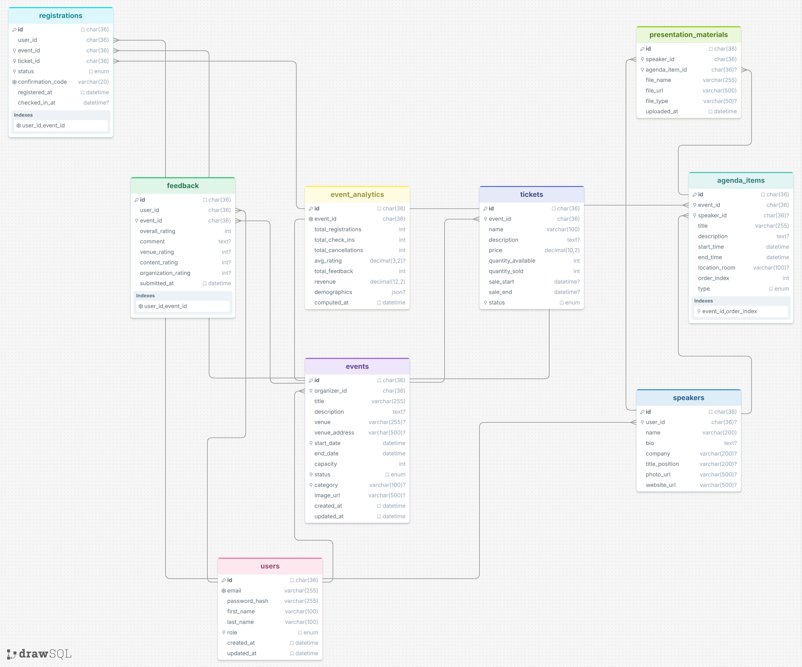

# Event Management System

## Contents

1. [API Endpoints](#api-endpoints)
2. [Database Schema](#database-schema)

---
# API endpoints

## Authentication `Public`

| Method | Endpoint | Description |
|--------|----------|-------------|
| `POST` | `/auth/register` | Register new user |
| `POST` | `/auth/login` | Login, returns JWT |
| `POST` | `/auth/logout` | Invalidate token |
| `POST` | `/auth/forgot-password` | Request password reset |

---

## Users `Authenticated`

| Method | Endpoint | Description |
|--------|----------|-------------|
| `GET` | `/users/me` | Get current user profile |
| `PUT` | `/users/me` | Update current user profile |
| `GET` | `/users/{id}` | Get user by ID (admin) |
| `GET` | `/users` | List users (admin, paginated) |

---

## Events `Core Resource`

| Method | Endpoint | Description |
|--------|----------|-------------|
| `POST` | `/events` | Create event (organizer) |
| `GET` | `/events` | List events (filterable, paginated) |
| `GET` | `/events/{id}` | Get event details |
| `PUT` | `/events/{id}` | Update event (organizer) |
| `PATCH` | `/events/{id}/status` | Change event status |
| `DELETE` | `/events/{id}` | Delete event (organizer) |
| `GET` | `/events/{id}/summary` | Event summary with stats |

### Query Parameters for `GET /events`

| Parameter | Type | Description |
|-----------|------|-------------|
| `status` | string | Filter by status: `DRAFT`, `PUBLISHED`, `CANCELLED`, `COMPLETED` |
| `category` | string | Filter by event category |
| `date_from` | ISO 8601 | Events starting after this date |
| `date_to` | ISO 8601 | Events starting before this date |
| `page` | int | Page number (default: 0) |
| `size` | int | Page size (default: 20) |
| `sort` | string | Sort field and direction, e.g. `start_date,asc` |

---

## Tickets

| Method | Endpoint | Description |
|--------|----------|-------------|
| `POST` | `/events/{eventId}/tickets` | Create ticket type |
| `GET` | `/events/{eventId}/tickets` | List ticket types for event |
| `GET` | `/events/{eventId}/tickets/{id}` | Get ticket details |
| `PUT` | `/events/{eventId}/tickets/{id}` | Update ticket type |
| `DELETE` | `/events/{eventId}/tickets/{id}` | Remove ticket type |

---

## Registrations

| Method | Endpoint | Description |
|--------|----------|-------------|
| `POST` | `/events/{eventId}/registrations` | Register / purchase ticket |
| `GET` | `/events/{eventId}/registrations` | List registrations (organizer) |
| `GET` | `/registrations/{id}` | Get registration details |
| `PATCH` | `/registrations/{id}/cancel` | Cancel registration |
| `PATCH` | `/registrations/{id}/check-in` | Check in attendee |
| `GET` | `/users/me/registrations` | My registrations |

---

## Agenda & Speakers

### Agenda Items

| Method | Endpoint | Description |
|--------|----------|-------------|
| `POST` | `/events/{eventId}/agenda` | Add agenda item |
| `GET` | `/events/{eventId}/agenda` | Get full agenda |
| `PUT` | `/events/{eventId}/agenda/{id}` | Update agenda item |
| `DELETE` | `/events/{eventId}/agenda/{id}` | Remove agenda item |
| `PATCH` | `/events/{eventId}/agenda/reorder` | Reorder agenda items |

### Speakers

| Method | Endpoint | Description |
|--------|----------|-------------|
| `POST` | `/speakers` | Create speaker profile |
| `GET` | `/speakers` | List speakers |
| `GET` | `/speakers/{id}` | Get speaker details |
| `PUT` | `/speakers/{id}` | Update speaker |

### Presentation Materials

| Method | Endpoint | Description |
|--------|----------|-------------|
| `POST` | `/speakers/{id}/materials` | Upload presentation file |
| `GET` | `/speakers/{id}/materials` | List materials |

---

## Feedback & Analytics

### Feedback

| Method | Endpoint | Description |
|--------|----------|-------------|
| `POST` | `/events/{eventId}/feedback` | Submit feedback |
| `GET` | `/events/{eventId}/feedback` | List feedback (organizer) |
| `GET` | `/events/{eventId}/feedback/summary` | Aggregated ratings |

### Analytics

| Method | Endpoint | Description |
|--------|----------|-------------|
| `GET` | `/events/{eventId}/analytics` | Event analytics dashboard |
| `GET` | `/events/{eventId}/analytics/attendance` | Attendance over time |

---

## Database Schema

